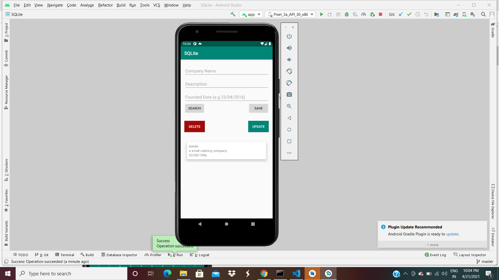

# This is my Readme for ICP 12

In this ICP we have focused on the Firebase and SQlite databases

# OUTPUTS

## Firebase

1. Initial home page when android studio is executed

2. This is when we signup to fill our details

3. This is when we try to login 

5. This is when we save information into the database with user name and phone number. We can also delete the saved data from the database here

## SQlite

1. Initial home page when android studio is executed

2. This is when we enter the employer detais like regarding the company

3. This is when we enter the employee details with the comapny representation 

4. This is when we delete the data of the employee

