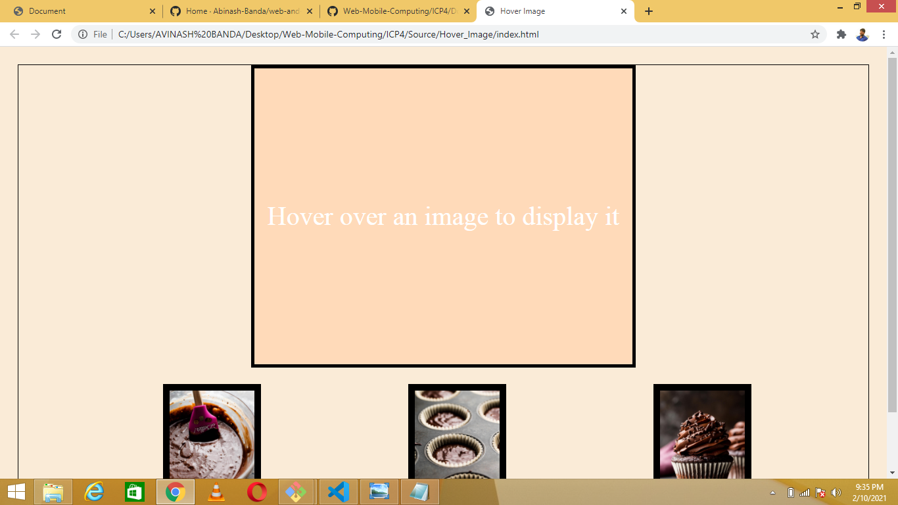
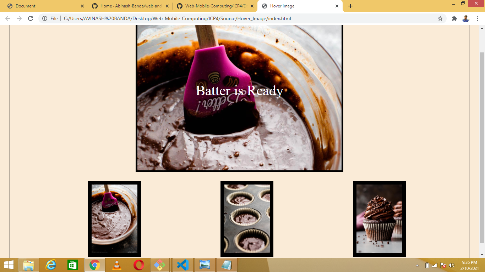
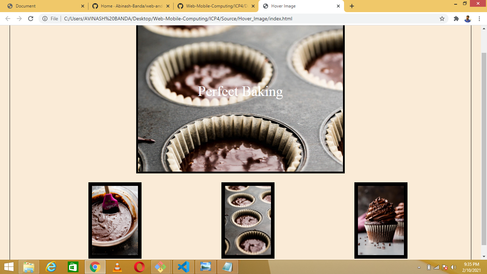
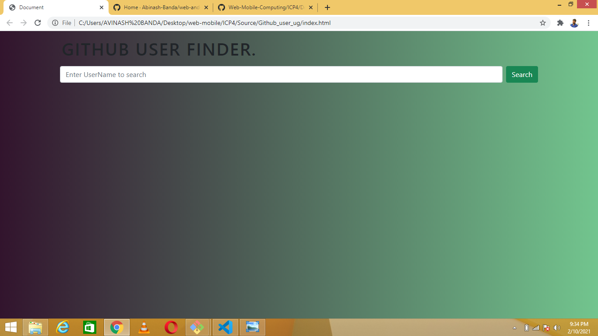
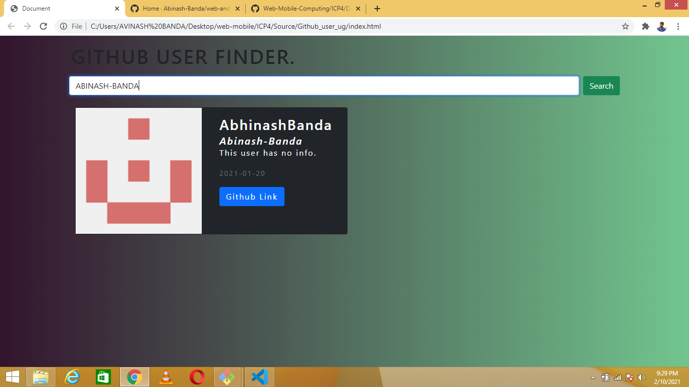
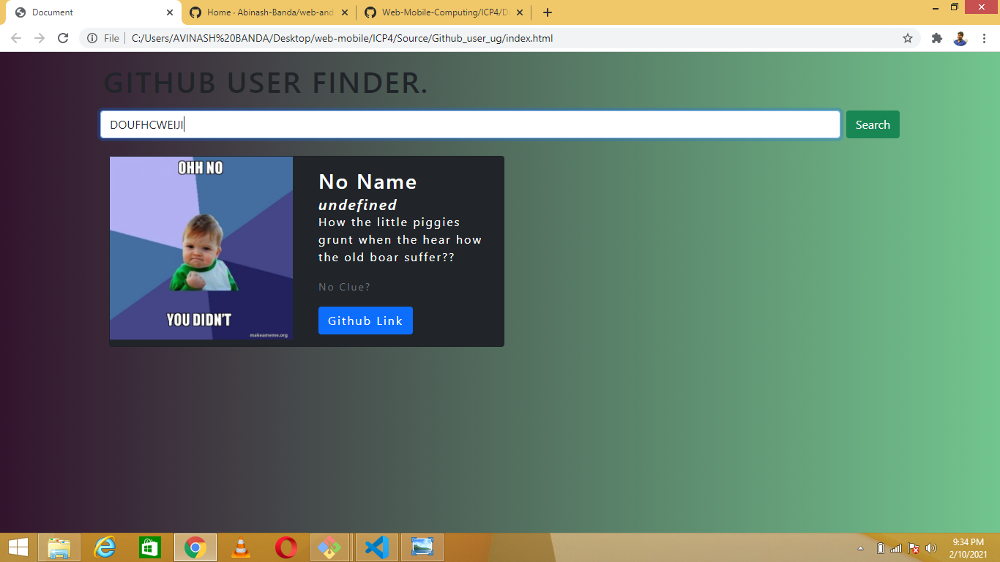

# This is for ICP4

This ICP4 is all about using all the concepts that were learned previously. And additionally i need to use the javascript objects and also work with an API.

And also i've used javascript traditional fetch() for getting the data from the API.

# OUTPUTS

## First Task

1. Initial screen when the html file is loaded.
   

2. Screen after hovering over an image.
   

3. After mouse out.
   

## Second Task

1. Initial screen when the html file is loaded.
   

2. After searching for the user.
   

3. Another example for searching an user.
   
