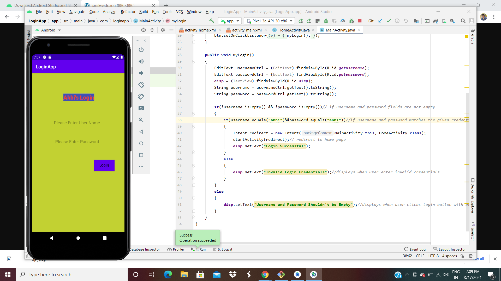

# This is my readme for ICP8

In this icp i've learned all about inital states of android studio and how it works and also learned how to setup android studio and also on how to create my first project as well.

# OUTPUTS

1. Initial screen when app was executed
    

2. After Loging in
    