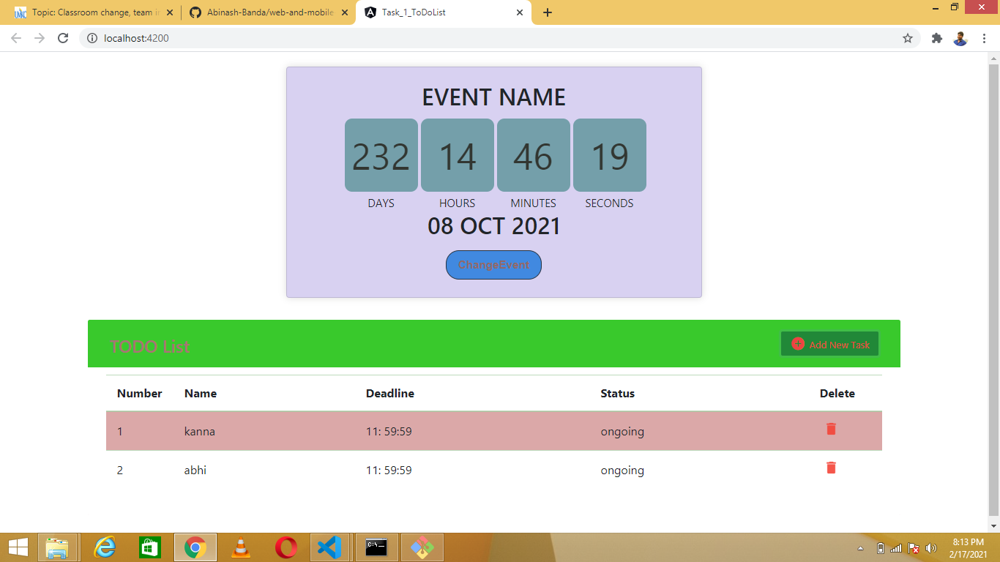
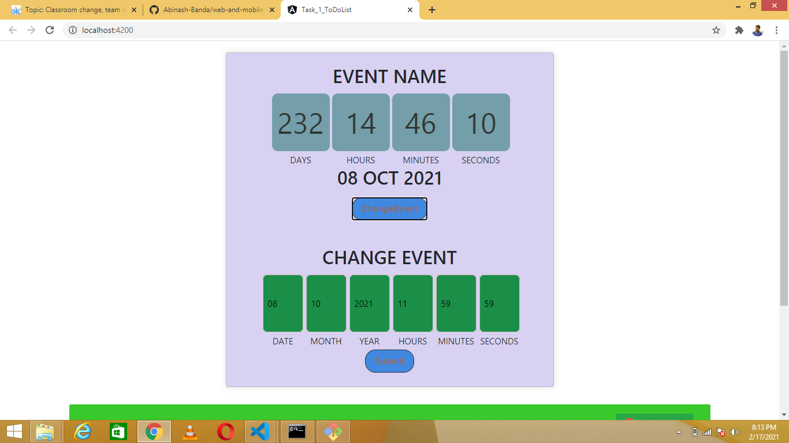
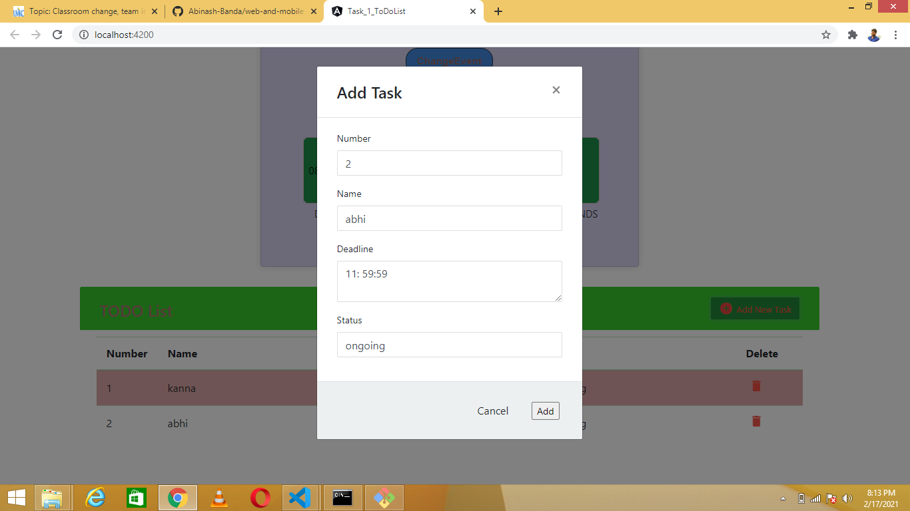

# Web- program ICP 5

In this ICP I installed node.js and got to know about angulat and typescript by installing them

# Basic Requirements of this ICP

1. Nodejs

2. Install the angular cli then use the command. npm install -g @angular/cli

3. Gone through the angular documentation for my first project

# Output

Final output with both todo list and events are displayed below

1. when the command ng server --open is executed.

2. When we add an event

3. When we add an To-DO list

